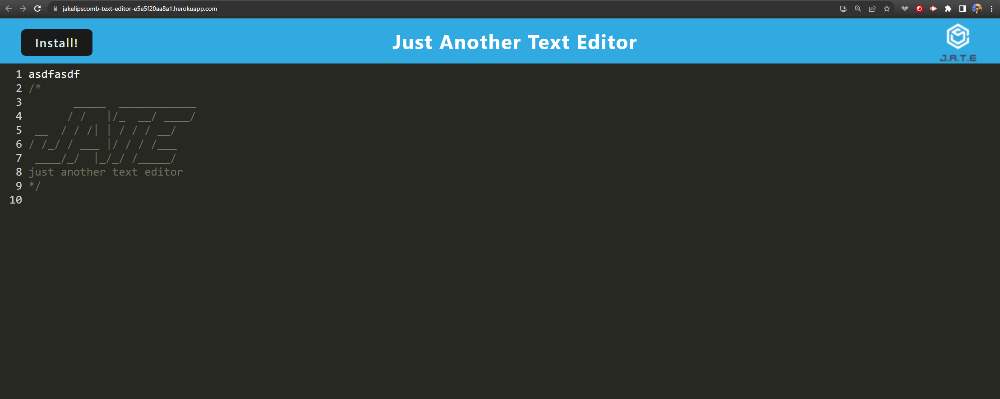

# text-editor (J.A.T.E.)
  by Jake Lipscomb
  

## Click the screenshot to watch my walkthrough video on YouTube!

## Visit the live client through Heroku!
https://jakelipscomb-text-editor-e5e5f20aa8a1.herokuapp.com/

  ## Table of Contents
  * [Description](#description)
  * [Requirements](#requirements)
  * [Usage](#usage)
  * [Contact-Info](#contact-info)
  * [Contributors](#contributors)
  * [Testing](#testing)
* [License](#license)

## Description
The purpose of this project was to build a text editor that runs in the browser. The app would be a single-page application that meets the PWA criteria. Additionally, it would feature a number of data persistence techniques that serve as redundancy in case one of the options is not supported by the browser. By creating notes or code snippets with or without an internet connection, this project would be useful to retrieve information stored for later use.
## Requirements
    Express ver. ^4.17.1

    Webpack: ^5.51.1
    webpack-cli: ^4.8.0,
    webpack-dev-server: ^4.0.0,
    webpack-pwa-manifest: ^4.3.0,
    workbox-webpack-plugin: ^6.2.4

    idb: ^6.1.2

## Usage
Node, JSON, JavaScript
## Contact-Info
* Username: jakelipscomb (https://github.com/jakelipscomb/)
* Email: jlipscombtx95@gmail.com
## Contributors
none
## Testing

To recreate this project, begin by cloning through:

    git clone https://github.com/jakelipscomb/text-editor.git

To install required packages for both client and server, run in terminal:

    npm i

To create a client dist folder if there is not already one, input in command line:

    npm run build

Run application with

    npm start

This will run the application locally using `localhost`

## License
      This Project is using the MIT license.
